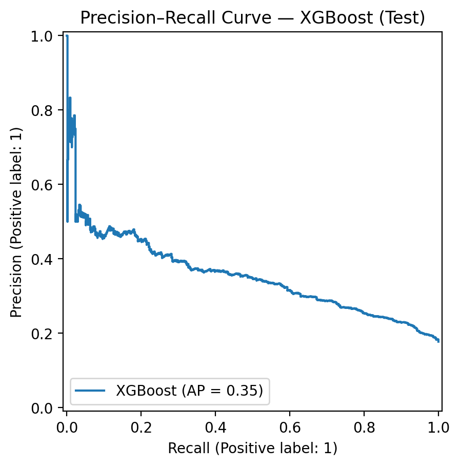
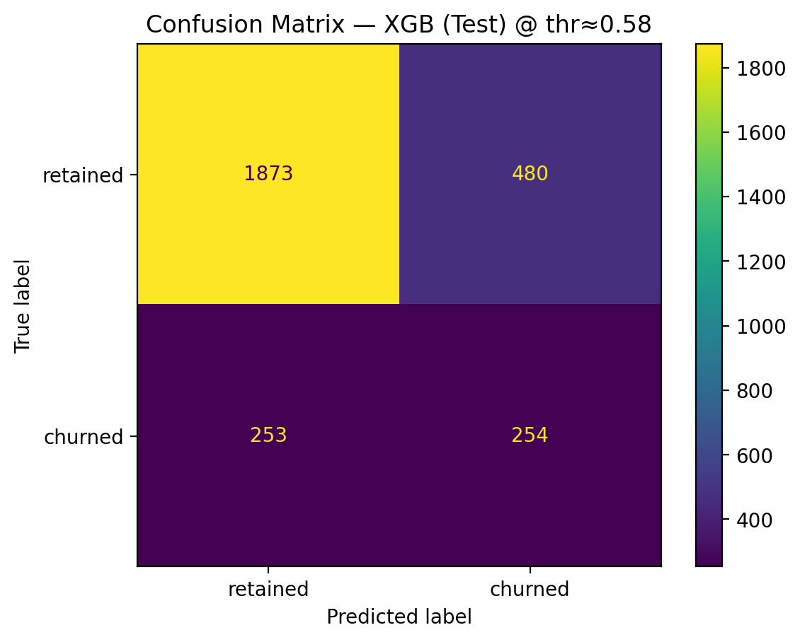
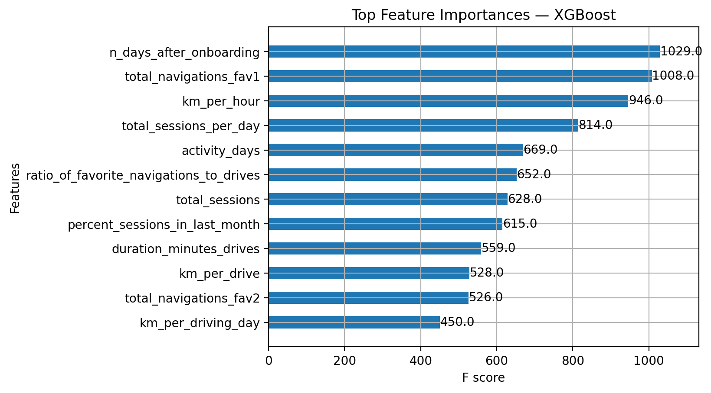
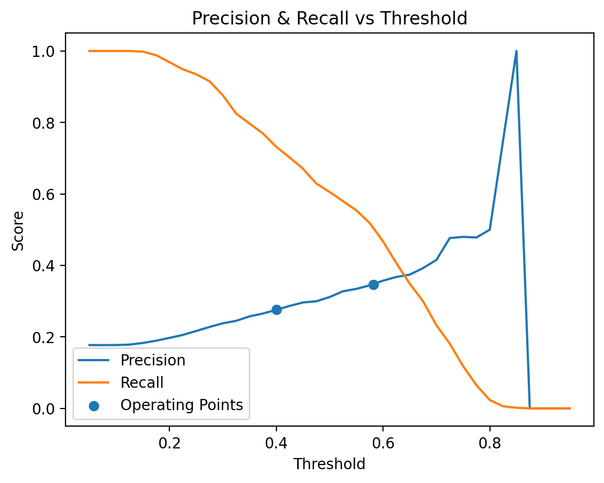
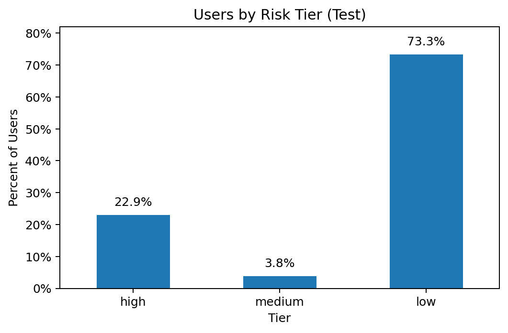

> This project is part of the [Google Advanced Data Analytics Professional Certificate](https://www.coursera.org/professional-certificates/google-advanced-data-analytics) and focuses on predicting churn in the Waze mobile app using behavioral signals.
>
> See the final [Capstone Project](link_to_be_added) for the culminating deliverable of this certificate (link to be added).

# Waze Churn Prediction Project

## Business Case
User churn impacts engagement, ad revenue, and acquisition costs. The goal is to identify users at risk of churn early enough to trigger targeted, cost-effective retention actions.

## Objective
Build a practical, explainable churn model and choose an operating threshold that aligns with business priorities (recall-first), then translate insights into **actionable outreach tiers**.

## What We Built

### Champion Model & Operating Point
- **Champion:** XGBoost (selected over Random Forest on a recall-first objective).
- **Default 0.50 threshold (test):** Precision **0.312**, Recall **0.606**, F1 **0.412**, Accuracy **0.693**, ROC AUC **0.721**, PR AUC **0.354**.
- **Operational threshold (chosen):** **~0.58** (from PR curve) → Precision **0.346**, Recall **0.501**, F1 **0.409**, Accuracy **0.743**.  
  *Rationale:* Meets a ~0.50 recall floor while improving precision/accuracy versus more aggressive settings.
- **Optional light-touch tier:** **0.40** → Precision **0.276**, Recall **0.732**, F1 **0.401**, Accuracy **0.612** (use when outreach cost is very low).

> Note: AUC metrics (ROC/PR) are **threshold-independent**; they remain ~0.72 / ~0.35 across operating points.


### Model Card (Key Metrics)

| Split      | Model       | Threshold | Precision | Recall | F1    | Accuracy | ROC AUC | PR AUC |
|-----------:|:------------|:----------|----------:|------:|------:|---------:|--------:|-------:|
| Validation | Random Forest | 0.50    | 0.405     | 0.363 | 0.383 | 0.793    | 0.742   | 0.369  |
| Validation | XGBoost     | 0.50      | 0.341     | 0.651 | 0.448 | 0.715    | 0.747   | 0.363  |
| **Test**   | **XGBoost** | **0.50**  | **0.312** | **0.606** | **0.412** | **0.693** | **0.721** | **0.354** |
| **Test**   | **XGBoost** | **~0.58** | **0.346** | **0.501** | **0.409** | **0.743** | **0.721** | **0.354** |
| Test       | XGBoost     | 0.40      | 0.276     | 0.732 | 0.401 | 0.612    | 0.721   | 0.354  |

> **Takeaway:** Threshold selection is a business lever. We adopted **~0.58** for a balanced launch; add **0.40** as a light-touch tier when outreach is cheap (e.g., banners/email).

### Key Drivers (Feature Importance)
Early engagement and consistent usage dominate:
- **Days since onboarding** (first **60–90 days** are critical)
- **Recent session intensity** (e.g., `percent_sessions_in_last_month`)
- **Favorites usage** (e.g., `ratio_of_favorite_navigations_to_drives`)
- Additional engineered ratios capturing behavior over time

### Key Visuals
**Precision–Recall Curve (Test) with operating points**  
  
*Operating at ~0.58 (≈50% recall, ≈35% precision). Optional 0.40 tier lifts recall to ≈73%.*

**Confusion Matrix (Test @ ~0.58)**  
  
*Makes trade-offs tangible (true/false positives/negatives in counts).*

**Top Feature Importances (XGBoost, Top 12)**  
  
*Explains why users are flagged — supports product/marketing interventions.*


---

## Data
- **Source:** Synthetic Waze user data provided by the course  
- **Features:** Session frequency, driving behavior, trip types, in-app interactions + engineered ratios (e.g., `percent_sessions_in_last_month`, `ratio_of_favorite_navigations_to_drives`, `km_per_hour`)  
- **Privacy:** Synthetic dataset; no PII processed.

## Project Stages (PACE Framework)
- **Plan:** Define business problem, stakeholders, and project scope  
- **Analyze:** Explore the data and identify patterns  
- **Construct:** Build predictive models to identify churn  
- **Execute:** Deliver insights, visualizations, and business recommendations

## Proposal Documents
- [Markdown version](proposal/waze_proposal.md)  
- [PDF version](proposal/waze_proposal.pdf)

## Folder Structure
```
waze-churn-prediction/
├── data/                           # Raw & Cleaned data
│ ├── waze_dataset.csv
│ ├── waze_features_v1.csv
│ ├── waze_features_v2.csv
│ └── waze_modeling_set.csv
├── models/                         # Saved models
│ ├── rf_cv.pkl
│ └── xgb_cv.pkl
├── notebooks/                      # Jupyter notebooks (by course)
│ ├── 01_foundations_of_ds.ipynb
│ ├── 02_get_started_python.ipynb
│ ├── 03_go_beyond_the_numbers.ipynb
│ ├── 04_power_of_statistics.ipynb
│ ├── 05_regression_analysis.ipynb
│ ├── 06a_machine_learning.ipynb
│ └── 06b_machine_learning.ipynb
├── proposal/                       # Project planning documents
│ ├── waze_proposal.md
│ └── waze_proposal.pdf
├── reports/                        # Executive summaries
├── visuals                         # Saved images & charts
├── .gitignore                      # Files to exclude from version control
├── LICENSE
└── README.md                       # Project overview
```


## Tools
- **Language:** Python  
- **Libraries:** Pandas, NumPy, Scikit-learn, XGBoost, Matplotlib, Seaborn  
- **Environment:** Jupyter

## Scoring New Data (Example)

```python
import pickle
THRESHOLD = 0.582  # chosen operating point

with open("models/xgb_cv.pkl","rb") as f:
    xgb_cv = pickle.load(f)
xgb_best = xgb_cv.best_estimator_

# Score new data (columns must match training features)
probs = xgb_best.predict_proba(new_X)[:, 1]
preds = (probs >= THRESHOLD).astype(int)
```
## Ethical Use & Monitoring

- **Purpose & proportionality:** Use the model to *reduce missed churners* and improve user experience—not to justify intrusive contact or unrelated targeting.
- **Threshold accountability:** Operating thresholds directly control false positives/negatives. Review them with stakeholders (Product, Marketing, Legal) and document the rationale for changes.
- **Post-deployment monitoring:** Track **flag rate**, **precision**, **recall**, **false-positive rate among retained users**, and **miss rate (FN)**. Watch **calibration**, **data drift**, and **model drift**; re-train on a regular cadence.
- **Fairness & segments:** Periodically check performance across relevant user segments (e.g., region, device type) to detect unintended disparities. Address gaps via threshold adjustments, data enrichment, or retraining.
- **User experience guardrails:** Cap outreach frequency, honor opt-outs, and ensure messaging is helpful and contextually relevant.
- **Data handling:** This project uses **synthetic** data. For real data, follow data-minimization and retention policies; protect any PII via access controls and anonymization/pseudonymization where appropriate.

> Tested with Python 3.10, scikit-learn 1.4, and XGBoost 2.0 in VS Code (Jupyter extension).

## Acknowledgments

- Built as part of the **Google Advanced Data Analytics Professional Certificate**.
- Thanks to the course authors for the **synthetic Waze-like dataset** and project scaffolding used to structure this work.
- “Waze” is a trademark of its respective owner. This project is for educational purposes and is **not affiliated with or endorsed by Waze**.

## More Visuals (Appendix)

#### These support operational discussions and planning:

**Precision & Recall vs Threshold (Sweep)**  
  
*Shows how precision falls as recall rises when we lower the threshold. The markers indicate our chosen operating point (~0.58) and the optional light-touch tier (0.40), helping stakeholders pick an explicit trade-off.*

**Risk Tiers Distribution (Test)**  
  
*Quantifies expected outreach volume at each tier. Useful for planning message cadence, channel mix, and budget under the selected thresholds.*

## License

This project is licensed under the MIT License. See the [`LICENSE`](LICENSE) file for details.

## Author

**Christopher Bolduc**  
[LinkedIn](https://www.linkedin.com/in/christopher-david-bolduc/) • [GitHub](https://github.com/christopherbolduc)