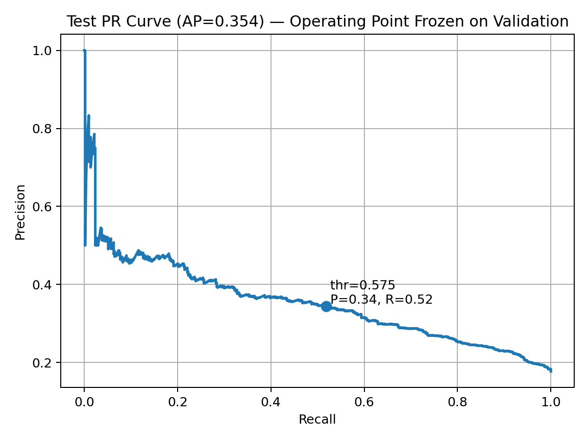

> This project is part of the [Google Advanced Data Analytics Professional Certificate](https://www.coursera.org/professional-certificates/google-advanced-data-analytics) and focuses on predicting churn in the Waze mobile app using behavioral signals.
>
> See the final [Capstone Project](link_to_be_added) for the culminating deliverable of this certificate (link to be added).

# Waze Churn Prediction Project

## Business Case
User churn impacts engagement, ad revenue, and acquisition costs. The goal is to identify users at risk of churn early enough to trigger targeted, cost-effective retention actions.

## Objective
Build a practical, explainable churn model and choose an operating threshold that aligns with business priorities (recall-first), then translate insights into **actionable outreach tiers**.

## What We Built

### Champion Model & Operating Point

- **Champion:** XGBoost (selected over Random Forest on a recall-first objective).  
- **Reference (test @ 0.50 cutoff):** Precision **0.312**, Recall **0.606**, F1 **0.412**, Accuracy **0.693**, ROC-AUC **0.721**, PR-AUC **0.354**.  
- **Operational threshold (frozen):** ≈ 0.575 — chosen on validation only via bootstrap-conservative (1st percentile).  
- **Test results at frozen policy:** Precision **0.344**, Recall **0.519**, F1 **0.414**, Accuracy **0.740**, Flag rate ≈ **26.7%**.  
- **Rationale:** Meets the ≥50% recall target while improving precision and reducing outreach vs. the 0.50 reference.  

>**Notes:**  
> AUC metrics (ROC/PR) are **threshold-independent** and remain ~0.72 / ~0.35 across operating points.  
> **Thresholds are selected on validation** (no test peeking). Model + policy are saved for reproducibility.  


## Model Card (Key Metrics)

### Model Selection & Validation (Baseline vs Candidates)

| Model         | Split                          | Precision | Recall | F1    | Accuracy | ROC-AUC | PR-AUC |
|---------------|--------------------------------|-----------|--------|-------|----------|---------|--------|
| Dummy         | Validation                     | 0.164     | 0.162  | 0.163 | 0.705    | 0.492   | 0.175  |
| Random Forest | CV (mean)                      | 0.414     | 0.346  | 0.377 | 0.797    | —       | —      |
| Random Forest | Validation                     | 0.405     | 0.363  | 0.383 | 0.793    | 0.742   | 0.369  |
| XGBoost       | CV (mean)                      | 0.332     | 0.634  | 0.435 | 0.709    | —       | —      |
| XGBoost       | Validation                     | 0.341     | 0.651  | 0.448 | 0.715    | 0.747   | 0.363  |
| XGBoost       | Test (@ 0.50 reference cutoff) | 0.312     | 0.606  | 0.412 | 0.693    | 0.721   | 0.354  |

>**Note:** CV rows summarize cross-validated training performance (ranking shown via recall/F1 here).  


---

### Operating Threshold (Chosen on Validation; Evaluated Once on Test)

| Policy                        | Threshold | Flag Rate | Precision | Recall | F1    | Accuracy | ROC-AUC | PR-AUC |
|-------------------------------|-----------|-----------|-----------|--------|-------|----------|---------|--------|
| VAL-picked ≥50% recall        | 0.602     | 22.9%     | 0.360     | 0.465  | 0.406 | 0.758    | 0.721   | 0.354  |
| Bootstrap (25th pct)          | 0.596     | 23.7%     | 0.355     | 0.473  | 0.405 | 0.754    | 0.721   | 0.354  |
| Bootstrap (10th pct)          | 0.590     | 24.5%     | 0.353     | 0.487  | 0.409 | 0.751    | 0.721   | 0.354  |
| Bootstrap (5th pct)           | 0.585     | 25.2%     | 0.350     | 0.497  | 0.410 | 0.747    | 0.721   | 0.354  |
| **Bootstrap (1st pct) — Final policy** | **0.575** | **26.7%** | **0.344** | **0.519** | **0.414** | **0.740** | **0.721** | **0.354** |

**Test confusion matrix at final policy (thr ≈ 0.575):**  TP **263**, FP **501**, FN **244**, TN **1852**.  


> **Takeaways:**
>- **Champion & lift:** XGBoost clearly leads; AP 0.354 ≈ 2x the dummy baseline (0.175) and captures ~3–4x more churners than baseline recall (0.16 -> 0.52–0.61).  
>- **Deployed operating point:** Threshold is frozen on validation via bootstrap-conservative (1st pct) to guarantee ≥50% recall on unseen data, yielding ~52% recall at ~34% precision with a 26.7% flag rate.  
>- **Trade-off clarity:** The 0.50 reference cutoff pushes recall to ~61% but increases outreach; ROC-AUC/PR-AUC remain stable (threshold-independent).  
>- **Rigor:** No test-set tuning; model + policy saved for reproducibility; risk tiers support capacity planning.  


### Key Drivers (Feature Importance)
Early engagement and consistent usage dominate:
- **Days since onboarding** (first **60–90 days** are critical)
- **Recent session intensity** (e.g., `percent_sessions_in_last_month`)
- **Favorites usage** (e.g., `ratio_of_favorite_navigations_to_drives`)
- Additional engineered ratios capturing behavior over time

---

### Key Visuals
**Precision–Recall Curve (Test) with operating point**


*Operating at ~0.575 (≈34% precision, ≈52% recall)*

**Confusion Matrix (Test @ ~0.575)**


*Makes trade-offs tangible: TP 263, FP 501, FN 244, TN 1852*

**Top Feature Importances (XGBoost, Top 10, F-score)**


*Explains why users are flagged; supports product/marketing interventions*

**Risk Tiers Distribution (Test)**


*Tiers derived from validation-picked thresholds; quantifies outreach volume under the frozen policy*

---

## Data
- **Source:** Synthetic Waze user data provided by the course  
- **Features:** Session frequency, driving behavior, trip types, in-app interactions + engineered ratios (e.g., `percent_sessions_in_last_month`, `ratio_of_favorite_navigations_to_drives`, `km_per_hour`)  
- **Privacy:** Synthetic dataset; no PII processed.

## Project Stages (PACE Framework)
- **Plan:** Define business problem, stakeholders, and project scope  
- **Analyze:** Explore the data and identify patterns  
- **Construct:** Build predictive models to identify churn  
- **Execute:** Deliver insights, visualizations, and business recommendations

## Proposal Documents
- [Markdown version](proposal/waze_proposal.md)  
- [PDF version](proposal/waze_proposal.pdf)

## Folder Structure
```
waze-churn-prediction/
├── data/                           # Raw & Cleaned data
│ ├── waze_dataset.csv
│ ├── waze_features_v1.csv
│ ├── waze_features_v2.csv
│ └── waze_modeling_set.csv
├── models/                         # Saved models
│ ├── rf_cv.pkl
│ ├── xgb_churn_policy.json
│ ├── xgb_churn_final_model.pkl
│ └── xgb_cv.pkl
├── notebooks/                      # Jupyter notebooks (by course)
│ ├── 01_foundations_of_ds.ipynb
│ ├── 02_get_started_python.ipynb
│ ├── 03_go_beyond_the_numbers.ipynb
│ ├── 04_power_of_statistics.ipynb
│ ├── 05_regression_analysis.ipynb
│ ├── 06a_machine_learning.ipynb
│ └── 06b_machine_learning.ipynb
├── proposal/                       # Project planning documents
│ ├── waze_proposal.md
│ └── waze_proposal.pdf
├── reports/                        # Executive summaries
├── visuals                         # Saved images & charts
├── .gitignore                      # Files to exclude from version control
├── LICENSE
└── README.md                       # Project overview
```


## Tools
- **Language:** Python  
- **Libraries:** Pandas, NumPy, Scikit-learn, XGBoost, Matplotlib, Seaborn  
- **Environment:** Jupyter

## Ethical Use & Monitoring

- **Purpose & proportionality:** Use the model to *reduce missed churners* and improve user experience; not to justify intrusive contact or unrelated targeting.
- **Threshold accountability:** Operating thresholds directly control false positives/negatives. Review them with stakeholders (Product, Marketing, Legal) and document the rationale for changes.
- **Post-deployment monitoring:** Track **flag rate**, **precision**, **recall**, **false-positive rate among retained users**, and **miss rate (FN)**. Watch **calibration**, **data drift**, and **model drift**; re-train on a regular cadence.
- **Fairness & segments:** Periodically check performance across relevant user segments (e.g., region, device type) to detect unintended disparities. Address gaps via threshold adjustments, data enrichment, or retraining.
- **User experience guardrails:** Cap outreach frequency, honor opt-outs, and ensure messaging is helpful and contextually relevant.
- **Data handling:** This project uses **synthetic** data. For real data, follow data-minimization and retention policies; protect any PII via access controls and anonymization/pseudonymization where appropriate.

> Tested with Python 3.10, scikit-learn 1.4, and XGBoost 2.0 in VS Code (Jupyter extension).

## Acknowledgments

- Built as part of the **Google Advanced Data Analytics Professional Certificate**.
- Thanks to the course authors for the **synthetic Waze-like dataset** and project scaffolding used to structure this work.
- "Waze" is a trademark of its respective owner. This project is for educational purposes and is **not affiliated with or endorsed by Waze**.

## License

This project is licensed under the MIT License. See the [`LICENSE`](LICENSE) file for details.

## Author

**Christopher Bolduc**  
[LinkedIn](https://www.linkedin.com/in/christopher-david-bolduc/) • [GitHub](https://github.com/christopherbolduc)